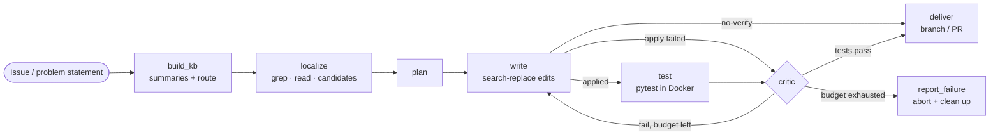

# repo-surgeon

[](https://github.com/SatvikSS/Multi-agent-orchestrator/actions/workflows/ci.yml)

A multi-agent coding orchestrator built on **LangGraph**. It takes a problem statement
(a GitHub issue or a local description) plus a target codebase (a **local folder** or a
**GitHub repo**) and runs a self-correcting agent pipeline to produce a fix — verified by
the repo's own test suite in a Docker sandbox.

## Architecture



The critic feeds real test failures back to the writer and loops until the suite passes or
the attempt/cost budget is exhausted. Each agent role is a separate, provider-switchable model.

## Status

🚧 Under active development. Working today:

- **Full agent pipeline**: knowledge-base routing → localizer → planner → writer
  (search-replace edits) → **Docker-sandboxed pytest** → critic self-correction loop
- **Any project shape**: git repos, subfolders, containers with nested repos
  (duplicate-clone detection), and plain folders (consented shadow-git or no-touch
  staging + `.patch` delivery)
- **GitHub end-to-end**: issue URL in → clone → fix → push → **pull request out**
- **Safety rails**: dirty-tree guard, work-branch isolation, crash cleanup, untracked
  files never committed
- **Fleet awareness**: `surgeon discover` registry + issue→project auto-routing
  (`surgeon run -i "..."` with no `--repo`)
- **LangSmith tracing** via `LANGCHAIN_TRACING_V2=true`
- **Semantic code search** (AST-chunked, embeddings-backed) as the writer's "related
  code" tool — optional, `semantic.enabled`
- **Evaluation harness**: `surgeon eval` runs a benchmark of seeded-bug cases and reports
  resolved-rate + metrics (real pytest in Docker)
- **Doc/non-test tasks**: localize non-code files, create/rewrite whole files, and
  `--no-verify` delivery for repos without a test suite
- **Streamlit demo** (`surgeon ui`) that streams the agents' progress live

## Design highlights

- **Provider-agnostic**: switch between OpenRouter, Ollama (local), Anthropic, and OpenAI
  per agent role via `config.yaml`.
- **Source-agnostic**: `Workspace` and `IssueSource` abstractions make "local folder today,
  GitHub repo tomorrow" a non-event.
- **Right-sized retrieval**: knowledge-base summaries route to a repo/folder, then
  ripgrep + read pinpoint the code; embeddings are a similarity *tool*, not the spine.

## Quickstart

```bash
uv sync --extra dev
cp .env.example .env    # add OPENROUTER_API_KEY (or another provider); Docker for the sandbox

# Fix a bug in a specific repo (verified by its tests):
uv run surgeon run -i "median() is wrong for even-length lists" --repo ./path/to/project

# Index all your projects, then fix by description (auto-routes to the right one):
uv run surgeon discover --root ~/Documents
uv run surgeon run -i "the chiller COP calculation is too high"

# A GitHub issue → clone, fix, open a PR:
uv run surgeon run -i https://github.com/you/repo/issues/42

# A doc task (no test suite needed):
uv run surgeon run --no-verify -i "update the README with project info" --repo ./proj

# Benchmark the resolved-rate:
uv run surgeon eval
```

### Live demo UI

```bash
uv sync --extra ui
uv run surgeon ui        # local Streamlit app; type a problem, watch the agents work
```

## Commands

| Command | What it does |
|---|---|
| `surgeon run` | Resolve an issue into a fix (branch or PR). Auto-routes if `--repo` omitted. |
| `surgeon discover --root <dir>` | Scan a projects folder into a registry (with summaries). |
| `surgeon projects` | List known projects (flags duplicate clones). |
| `surgeon index --repo <dir>` | Build the per-repo knowledge base. |
| `surgeon eval` | Run the benchmark; report resolved-rate + metrics. |
| `surgeon apply --patch <p> --repo <dir>` | Apply a staging-mode patch (with backups). |
| `surgeon ui` | Launch the Streamlit demo. |

## Development

```bash
uv run pytest -m "not docker"   # fast suite (LLM + Docker mocked/injected)
uv run pytest                    # full suite (Docker-backed tests need a daemon)
uv run ruff check .              # lint
uv run mypy src                  # types
```
